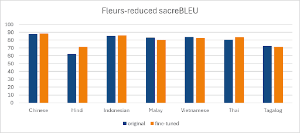

# CrossTalk Secure Finetuning Code Repository
Code repository containing code for finetuning and evaluating models for the CrossTalk Secure project.

CrossTalk Secure is a compact, portable offline speech-to-speech translation device designed to deliver accurate, low-latency translations while ensuring user privacy and security. Tailored for security personnel operating in Southeast Asia, it facilitates seamless and secure communication with foreigners, helping to overcome language barriers in an interconnected world where tourism is on the rise.

Handling the software portion of the translation device, we finetune the models: [whisper-large-v3-turbo](https://huggingface.co/openai/whisper-large-v3-turbo) and [nllb-200-distilled-600M](https://huggingface.co/facebook/nllb-200-distilled-600M).


## File Structure

```
├── preprocessing                                       | Preprocessing notebooks for data
│   ├── fleurs-subsets-upload.ipynb 
│   ├── parse_magichub_datasets.ipynb 
│   └── parse_translation_datasets.ipynb 
├── finetuning 
│   ├── nllb-finetune-lora-balanced-multi-corpora.py
│   │   └── Finetune NLLB using LoRA on balanced multilingual corpora.
│   ├── whisper-finetune-lora-cross-val.py
│   │   └── Finetune Whisper with LoRA using cross-validation monolingual subsets.
│   ├── whisper-finetune-lora-unified.py 
│   │   └── Finetune Whisper with LoRA on a unified multilingual dataset.
│   └── whisper-finetune-full-unified.py
│       └── Full finetune of Whisper on unified multilingual dataset.
├── evaluation
│   ├── nllb-evaluate-example.py
│   │   └── Example script showing how to evaluate using NLLB models on sample data.
│   ├── nllb-evaluate-fleurs-reduced-on-whisper-preds.py
│   │   └── Evaluates NLLB translations against Whisper-generated predictions on a reduced FLEURS dataset.
│   ├── nllb-evaluate-fleurs-reduced.py
│   │   └── Evaluates NLLB model outputs directly on the reduced FLEURS dataset.
│   ├── nllb-evaluate-with-comet.py
│   │   └── Uses COMET scoring to evaluate NLLB translation quality.
│   ├── whisper-evaluate-ctranslate2.py
│   │   └── Evaluates Whisper outputs generated with CTranslate2 backend.
│   ├── whisper-evaluate-fleurs-reduced-ctranslate2.py
│   │   └── Evaluates Whisper (CTranslate2) predictions on the reduced FLEURS dataset.
│   └── whisper-evaluate-fleurs-reduced.py
│       └── Evaluates Whisper model outputs on the reduced FLEURS dataset (transformers backend).
├── .gitignore
├── README.md
├── jfk.flac
├── whisper_lib.py
├── merge-and-upload.py
├── convert-to-pt.py
└── requirements.txt
```

## Datasets
To support the languages of the device, we curated a range of datasets for training and evaluation.

### Supported Languages 

| Language         | ISO Code |
| ---------------- | -------- |
| English          | `en`     |
| Chinese          | `zh`     |
| Indonesian       | `id`     |
| Tagalog/Filipino | `tl`     |
| Hindi            | `hi`     |
| Thai             | `th`     |
| Vietnamese       | `vi`     |
| Malay            | `ms`     |

### Text-to-Text Translation Datasets

Combined into the consolidated dataset: [keeve101/balanced-multi-corpora-mt](https://huggingface.co/datasets/keeve101/balanced-multi-corpora-mt)

These datasets span a range of language pairs and sources, curated to support the languages of the device.

|Dataset|
|------------------------------------------------------------------------------------------------|
| [shareAI/ShareGPT-Chinese-English-90k](https://huggingface.co/datasets/shareAI/ShareGPT-Chinese-English-90k/tree/main/sharegpt_jsonl) |
| [Wikidepia/IndoParaCrawl](https://huggingface.co/datasets/Wikidepia/IndoParaCrawl/tree/main)  |
| [rhyliieee/tagalog-filipino-english-translation](https://huggingface.co/datasets/rhyliieee/tagalog-filipino-english-translation/tree/main) |
| [baudm/tl2en-nmt](https://github.com/baudm/tl2en-nmt/tree/master/corpus/corrected)             |
| [cfilt/iitb-english-hindi](https://huggingface.co/datasets/cfilt/iitb-english-hindi/tree/main/data) |
| [vistec-AI/scb-mt-en-th-2020_v1.0](https://github.com/vistec-AI/dataset-releases/releases/tag/scb-mt-en-th-2020_v1.0) |
| [stefan-it/nmt-en-vi](https://github.com/stefan-it/nmt-en-vi/tree/master/data)                |
| [Corpus-OpenSubtitles](https://opus.nlpl.eu/OpenSubtitles/ms&en/v2024/OpenSubtitles)          |

### Speech-to-text Translation Datasets
The datasets were sourced from various deltas from [Common Voice](https://commonvoice.mozilla.org/en/datasets), as well as the Malay and Tagalog open-source datasets from [MagicHub](https://magichub.com/datasets/).

| Dataset                                                                                        |
|------------------------------------------------------------------------------------------------|
| [keeve101/common-voice-unified-splits](https://huggingface.co/datasets/keeve101/common-voice-unified-splits) |
| [keeve101/magic-hub-ms-tl-datasets](https://huggingface.co/datasets/keeve101/magic-hub-ms-tl-datasets) |

### Evaluation Datasets
Along with test splits for each dataset, we used a reduced version of the [FLEURS](https://huggingface.co/datasets/google/fleurs) dataset for evaluation, looking out for out-of-domain performance and model robustness.

| Dataset                                                                                   |
|------------------------------------------------------------------------------------------------|
| [keeve101/fleurs-reduced](https://huggingface.co/datasets/keeve101/fleurs-reduced)            |
| [keeve101/fleurs-conversations](https://huggingface.co/datasets/keeve101/fleurs-conversations)|

### Results

Following fine-tuning, overall performance improvements were observed across the Whisper and NLLB-200 models, as measured by [WER](https://huggingface.co/spaces/evaluate-metric/wer), [SacreBLEU](https://huggingface.co/spaces/evaluate-metric/sacrebleu), and [COMET](https://huggingface.co/spaces/evaluate-metric/comet) scores. 

For Whisper, while most languages improved, there were some performance drops in languages like Malay and Tagalog, contrasted by significant gains in Chinese and Hindi transcription accuracy.

NLLB-200 exhibited consistent improvements across all translation directions, suggesting effective adaptation during fine-tuning.

We report [SacreBLEU](https://huggingface.co/spaces/evaluate-metric/sacrebleu) scores on the fleurs-reduced dataset for both models as the primary evaluation metric.

#### Whisper-Large-v3-Turbo



#### NLLB-200


## Setup

1. **Clone the repository**  
   ```bash
   git clone https://github.com/keeve101/speech-translation-capstone-finetune.git
   cd speech-translation-capstone-finetune
   ```

2. **Create and activate a virtual environment (optional but recommended)**  
   ```bash
   python -m venv venv
   source venv/bin/activate  # or venv\Scripts\activate on Windows
   ```

3. **Install dependencies**  
   ```bash
   pip install -r requirements.txt
   ```

## Utilities

- `convert-to-pt.py`  
  Converts raw or intermediate model outputs to `.pt` format for compatibility with evaluation scripts.

- `merge-and-upload.py`  
  Merges prediction files and uploads them to cloud or experiment tracking services.

- `whisper_lib.py`  
  Core utility library used by Whisper fine-tuning and evaluation scripts (e.g., data loading, preprocessing, decoding).

- `jfk.flac`  
  Sample audio file (John F. Kennedy speech) used for testing inference pipelines on the evaluate example scripts.

## Preprocessing

The [`preprocessing`](./preprocessing) notebooks:
- Upload and slice subsets of the FLEURS dataset
- Parse open-source datasets (e.g., MagicHub)
- Normalize and prepare text-to-text and speech-to-text corpora

## Finetuning

See the [`finetuning`](./finetuning) directory for training scripts:
- Scripts use either **LoRA** for lightweight updates or full fine-tuning.
- You can modify corpus paths, model configs, or training settings directly in each script.

## Evaluation

Evaluation scripts are in the [`evaluation`](./evaluation) folder and include:
- BLEU and COMET-based scoring
- Support for Whisper and NLLB models
- CTranslate2 and Transformers inference backends


## Usage

### Finetune Whisper/NLLB:
The `model_path` parameter in the script will be used to load the model checkpoint. 

To run finetuning on the original Whisper model or to continue training from an existing checkpoint you can use the following command:
```bash
python finetuning/whisper-finetune-lora-unified.py 
```

To run finetuning on the original NLLB-200 model or to continue training from an existing checkpoint you can use the following command:
```bash
python finetuning/nllb-finetune-lora-balanced-multi-corpora.py
```

The `output_dir` parameter in the script will be used to save the model checkpoints. Be sure to change the `output_dir` parameter if you intend on training multiple models.

### Merging LoRA adapters to model checkpoints:
The `merge-and-upload.py` script can be used to merge LoRA adapters to model checkpoints and upload the merged checkpoints to the Hugging Face Hub:
```bash
python merge-and-upload.py \
  --model openai/whisper-large-v3-turbo \
  --adapter_path output-unified-weighted-random-sampler-full-finetune-v2/\
  --repo_owner keeve101 \
  --convert_to_pt True
```
The merged model will be saved onto the `merged_model_path` parameter in the script, initialized as the model path's base name. The `repo_id` parameter `{repo_owner}/{model_name}` will be the repository path on the Hugging Face Hub.

### Evaluate Whisper/NLLB on FLEURS subset:
To run evaluation on the original NLLB-200 model or a finetuned version, you can use the following command:
```bash
python evaluation/nllb-evaluate-fleurs-reduced.py \
  --model_name keeve101/nllb-200-distilled-600M-finetune-lora-balanced-multi-corpora-checkpoint-100925
```

To run evaluation on the original Whisper model or a finetuned version, you can use the following command:
```bash
python evaluation/nllb-evaluate-fleurs-reduced.py \
  --model_name keeve101/whisper-large-v3-turbo-full-finetune-unified-checkpoint-2400
```
The corresponding evaluation results will be saved onto the `output_file_path` parameter in the script. By default, the parameter is set to `{model_name}-eval.json`.

To support Whisper models on the CTranslate2 backend, you can use the following command to run evaluation on Whisper models with on the CTranslate2 backend:
```bash
python evaluation/whisper-evaluate-fleurs-reduced-ctranslate2.py \
  --model_path keeve101/whisper-large-v3-turbo-full-finetune-unified-checkpoint-2400 \
  --device cuda \ 
  --compute_type int8_float16
```
The converted model will be saved onto the `output_dir` parameter in the script, with the path `{ctranslate2-models/{model_name}`. Conversion will be done using the `ct2-transformers-converter` API from the [CTranslate2 Python library](https://github.com/OpenNMT/CTranslate2). Conversion will not be done if the `output_dir` directory already exists.

### Evaluate NLLB on FLEURS subset (using COMET):
After running the initial evaluation scripts, you can further evaluate the sources (in original language), references (in target language) and predictions (in target language) using the COMET scoring script:
```bash
python evaluation/nllb-evaluate-with-comet.py \
  --whisper_modeL_used keeve101/whisper-large-v3-turbo-full-finetune-unified-checkpoint-2400 \
  --nllb_model_used facebook/nllb-200-distilled-600M
```

## Limitations
Publicly available data is limited for certain languages, particularly Malay and Tagalog, and often lacks contextual relevance to the intended use case. Consequently, the data used may not have been fully validated and was significantly constrained by the availability of clean, relevant datasets. For future enhancements, allocating a dedicated research team to curate high-quality, context-specific fine-tuning data would be advantageous for improving model accuracy. 

Another challenge we faced was with potential data leakage from publicly available datasets. Though we attempted to cross-reference our data sources with sources cited from the authors of Whisper Large-v3-Turbo and NLLB-200, Whisper's training data remains undisclosed, which limits our ability to guarantee full separation. 

To mitigate this, we prioritized datasets released after the model's official release date. For future iterations, a more rigorous approach would involve procuring proprietary datasets or curating a bespoke dataset tailored to our specific domain, particularly in the context of secure communications, and the data's origin verified.

## Notes
### Previous Finetuning Run Statistics

| Model Name                                             | Script Used                                    | Batch Size | Grad Accum Steps | GPUs Used      | Notes                                      |
|--------------------------------------------------------|------------------------------------------------|------------|------------------|----------------|--------------------------------------------|
| keeve101/whisper-large-v3-turbo-full-finetune-unified           | `whisper-finetune-full-unified.py`             | 64         | 1                | 1×L40S (48GB)  | Full finetuning on unified multilingual set |
| keeve101/whisper-large-v3-turbo-lora-unified                    | `whisper-finetune-lora-unified.py`             | 16         | 2               | 1×V100 (32GB)  | Lightweight finetuning using LoRA          |
| keeve101/nllb-200-distilled-600M-lora-balanced-multi-corpora    | `nllb-finetune-lora-balanced-multi-corpora.py` | 4         | 2                | 1×V100 (32GB)  | Balanced multilingual corpora              |

---

- Python version used: 3.11
- CUDA version used: 12.8.1
- The batch size and gradient accumulation steps were chosen both empirically and based on recommedations from Whisper authors at [whisper-fine-tune-event](https://github.com/huggingface/community-events/tree/main/whisper-fine-tuning-event).
- According to Whisper authors, the learning rate for finetuning is set to 40x less the initial learning rate used to train the corresponding Whisper model.
- It may also be good to scale the learning rate according to the effective batch size (effective batch size = batch size * gradient accumulation steps). E.g., if you double the effective batch size, you may consider doubling the learning rate as well.
